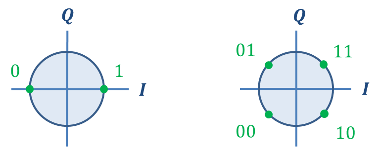

# What is Modem?

I bet that you've heard the word modem before.  Isn't it that box that gives me internet access? But do you know what it is?  A modem is shorthand for *modulator-demodulation*.

Modulation is all about transmitting information through a medium, or *channel*, in some specific way.  Information is
conveyed by modifying a template signal in a prescribed way that is understood by a receiver.  Here's our template signal:

\begin{equation}
    x(t) = A (t) \cos \left(\omega (t) t + \phi (t) \right). 
\end{equation}

Information is injected into this template by varying the amplitude $A(t)$, angular frequency $\omega (t)$, and or phase $\phi(t)$.  In this post, we will introduce a family of modulation techniques centered on varying the phase, called *Phase Shift Keying* (PSK).


## PSK Modulation

The standard derivation of PSK modulation follows from standard trigonometric identities:  

\begin{align}
    x_{p}(t) &= \cos (2\pi f_{c} t + \phi(t)) \\
             &= \cos (\phi(t)) \cos (2\pi f_{c} t) - \sin (\phi(t)) \sin (2\pi f_{c} t) \\
             &= I(t) \cos (2\pi f_{c} t) - Q(t) \sin (2\pi f_{c} t) 
\end{align}

The $I(t)= \cos (\phi(t))$ and $Q(t)=\sin (\phi(t))$ are the inphase and quadrature waveforms.  Its worth pointing out here
that our phase modulated signal is expressed in terms of amplitude modulation.

It turns out to be very convenient to represent this last expression in terms of complex waveforms:

\begin{align}
    x_{c} (t) = \operatorname{Re} (z_{b} (t) \exp(2\pi i f_{c} t)) 
\end{align}

where $z_{b} (t)$ is the complex baseband waveform

\begin{equation}
    z_{b} (t) = I(t) + i Q(t)=\exp(i\phi(t)).
\end{equation}

The complex formulation is great because it seperates the baseband waveform, $z_{b}$, from the potentially much higher frequency carrier.  

## PSK Demodulation


### Symbols

One of the most siginificant concepts in digital communications is a *symbol*.  Generally speaking, a symbol is the unit of information transmitted every second by a modulator.  This information may be represented on the bit-level, complex phase-level, and/or waveform level.  The correspondance between the bit and complex phase representations of symbols is visualized very effectively with a *constellation diagram*.  Below is the standard constellation for BPSK (left) and QPSK (right).  




Let's interpret these constellations.  Suppose you want to transmit the bit sequence $1,0,0,1,0,1$ through your channel.  If you choose to use BPSK, then the constellation diagram shows that this corresponds to the phase sequence $0,\pi,\pi,0,\pi,0$, or equivalently $+1,-1,-1,+1,-1,+1$.  

Similarly, if you use QPSK, the sequence of symbols is $10,01,01$ which corresponds to the phases 
$\frac{7\pi}{4}, \frac{3\pi}{4}, \frac{3\pi}{4}$ and the complex phasors 

\begin{equation}
    \frac{\sqrt{2}}{2} - i\frac{\sqrt{2}}{2}, 
    -\frac{\sqrt{2}}{2} + i\frac{\sqrt{2}}{2}, 
    -\frac{\sqrt{2}}{2} + i\frac{\sqrt{2}}{2}
\end{equation}


## BPSK


```rust
struct BpskEncoder {
    level: f64,
}
```

```rust
impl BpskEncoder {
    fn new(level:f64) -> BpskEncoder {
        BpskEncoder {level: level}
    }
    
    fn step(&self,symbol:u8) -> f64 {
        let sample = match symbol {
                         0 => -level,
                         1 => level,
                         _ =>  0.0
        };
        sample
    }
}
```

```rust
struct BpskDecoder {
    level: f64,
}
```

```rust
impl BpskDecoder {
    fn new(level:f64) -> BpskDecoder {
        BpskDecoder {level: level}
    }
    
    fn step(&self,sample:f64) -> u8 {
        let symbol = if sample >= 0.0 {1} else {0};
        symbol
    }
}
```

```rust
struct Channel {
    snr_db: f64,
}

impl Channel {

    fn new() -> Channel {
    
    }
    
    fn step(&self,sample:f64) -> f64 {
        
    }
}
```

```rust
fn run() {
    
}
```


Before we discuss the algorithmic details of differential encoding/decoding, it's important to motivate the reason for why it might be considered.

### Motivation

### The Algorithm
At the bit-level, the algorithm is extremely simple.  Given a sequence of input bits, ${ x_{i} }$ the differentially encoded stream of bits is defined by the following recurrence relation:

\begin{equation}
    y_{i} = y_{i-1} \oplus x_{i}
\end{equation}

The differential decoder runs in the receiver and recovers the original sequence from the encoded sequence as follows:

\begin{equation}
    z_{i} = y_{i-1} \oplus y_{i}
\end{equation}

So, why does this work?  Let's prove to ourselves that differentially decoding a differentially encoded bit sequence returns
the original sequence.  For each $i$,

\begin{align}
    z_{i} &= y_{i-1} \oplus y_{i} \\
          &= y_{i-1} \oplus \left( y_{i-1} \oplus x_{i} \right) \\
          &= x_{i} \oplus \left( y_{i-1} \oplus y_{i-1} \right) \\
          &= x_{i} \oplus 0 \\
          &= x_{i}
\end{align}

Of course a real communications channel will cause some of the $y_{i}$ bits to flip.  To see the channel's impact, let

\begin{equation}
    \bar{y}_{i} = y_{i} \oplus 1.
\end{equation}

and take a look at what happens when two consecutive bit errors occur:

\begin{align}
    z_{i} &= \bar{y}_{i-1} \oplus \bar{y}_{i} \\
          &= \left( y_{i-1} \oplus 1 \right) \oplus \left( y_{i} \oplus 1 \right) \\
          &= \left( y_{i-1} \oplus y_{i} \right) \oplus \left( 1 \oplus 1 \right) \\
          &= x_{i} \oplus 0 \\
          &= x_{i}. 
\end{align}

In other words, the differential decoder fixes two consecutive bit errors.


### Design Patterns
There are a variety of ways to implement a differential encoder/decoder.  I'm really after designing my algorithms in efficient and elegant ways.  One thing I want to try to avoid is being tied to a particular type of input.  I don't want to implement separate differential encoders when the bits are coming in one at a time and when they are given to me all at once.  I want to capture the *essence* of the algorithm in a flexible and reusable module.  And if I can do this using functional programming techniques, then that's just icing on the cake.  


The first thing I need is some way to maintain state during the course of the algorithm.  Here's one option.


```python
class Register(object):
    def __init__(self,val=None):
        self.val = val
    def push(self, new_value):
        self.val = new_value
    def peek(self):
        return self.val
```

Okay, now let's try to capture the essence of a differential encoder.  We are going to use a concept from functional programming called *currying* to do it.  All this really means is taking advantage of the mathematical fact that a function of two arguments can be interpreted as a function of one argument that returns another function of one argument.  What does currying look like in Python? Let's look at a simple example before getting to the differential encoder.  Consider a simple `adder` function that takes two numbers and adds them together:


```python
def adder(x,y):
    return x + y
```

Here's the curried version of this function.  


```python
def adder_c(x):
    def inner(y):
        return x + y
    return inner
```


```python
def diff_enc():
    state = Register(0)
    def step(bit, signal=None):
        if signal == 1:
            state.push(0)
            return bit
        curr   = state.peek()
        output = curr ^ bit
        state.push(output)
        return output
    
    return step
```


```python
def diff_dec():
    state = Register(0)
    def step(bit, signal=None):
        if signal == 1:
            state.push(0)
            return bit
        curr   = state.peek()
        output = curr ^ bit
        state.push(bit)
        return output
    return step
```


```python
enc = diff_enc()
dec = diff_dec()
```


```python
bits_in = list(map(enc,[0,1,1,0,0,1,1,0]))
```


```python
bits_out = list(map(dec,bits_in))
bits_out
```


    [0, 1, 1, 0, 0, 1, 1, 0]


```python
foo()
```


    ---------------------------------------------------------------------------

    NameError                                 Traceback (most recent call last)

    <ipython-input-21-624891b0d01a> in <module>()
    ----> 1 foo()
    

    NameError: name 'foo' is not defined


```python
list(map(foo,[1,1,0,1,0,1,1,0,1,0,0]))
```


    [1, 0, 0, 1, 1, 0, 1, 1, 0, 0, 0]


```rust
fn diff_enc() -> Box<FnMut(i8) -> i8> {
    let mut reg: i8 = 0;
    Box :: new (move |x:i8| {
        reg ^= x;
        reg
    }
}
```

```c++
auto diff_encode = [] () {
    auto reg = std::make_shared<int>(0);
    auto step = [reg](int bit,int flip) {
        int out = *reg ^ bit;
        *reg = out ^ flip;
        return out;
    };
    return step;
};
```

```c++
enum class Bit: uint8_t { L = 0, H = 1 };
```

\begin{cases} 
      0 & x\leq 0 \\
      \frac{100-x}{100} & 0\leq x\leq 100 \\
      0 & 100\leq x 
\end{cases}


```python

```
